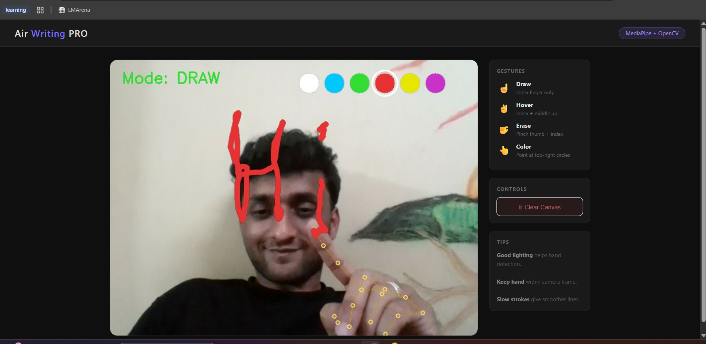
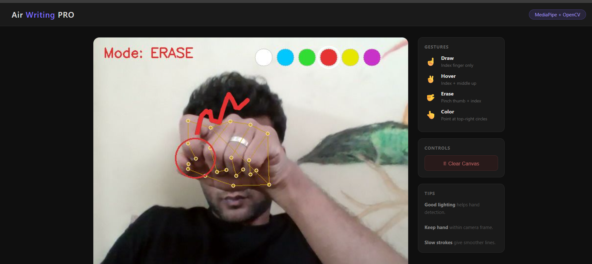
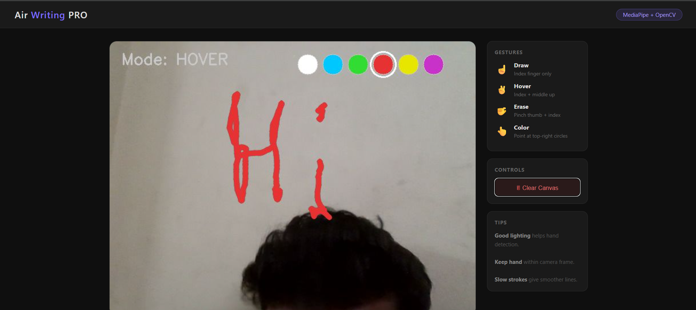

\# AI-Based Air Writing System


\## 📌 Overview

This project allows users to write in the air using hand gestures and converts it into digital text using computer vision.


\## 🚀 Features

\- Real-time hand tracking

\- Air drawing using webcam

\- Clear canvas option

\- Smooth stroke rendering

## 📸 Screenshots

### Drawing in Air


### UI View


### Demo



\## 🛠 Tech Stack

\- Python

\- OpenCV

\- MediaPipe

\- TensorFlow Lite


\## ▶️ How to Run

```bash

pip install -r requirements.txt

python air\_writer.py

